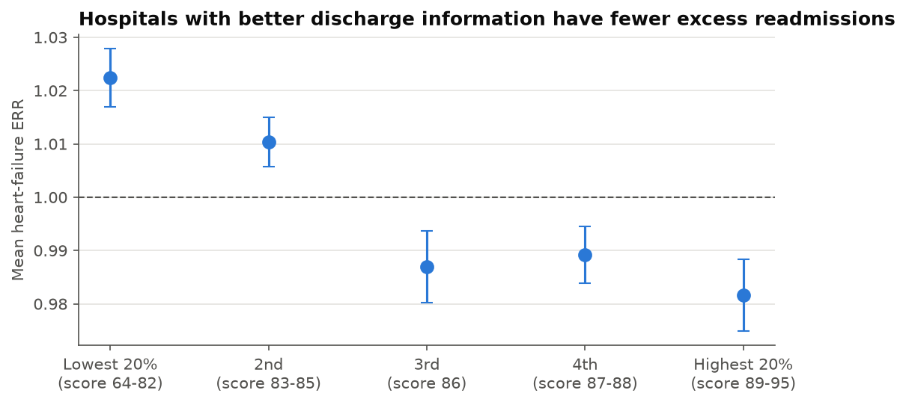

# Hospital Readmission Intelligence

> **Status: work in progress.** The project is built in public, step by step. Every important
> decision is committed separately and explained in [docs/decisions.md](docs/decisions.md).

## The problem

Medicare's **Hospital Readmissions Reduction Program (HRRP)** cuts up to **3% of a hospital's
Medicare base payments** when too many patients come back within 30 days of discharge for
heart attack, heart failure, pneumonia, COPD, hip/knee replacement or bypass surgery.

This project uses **real, public CMS and CDC data** on about 3,000 US hospitals to answer
three questions a hospital or health plan would pay for:

1. **Which hospitals are at risk** of a readmission penalty?
2. **Why?** Which drivers (patient experience, hospital profile, community health) explain the risk?
3. **What is it worth?** How many Medicare dollars are at stake, and what would improvement save?

## Data (all public, no patient-level data)

| Source | Grain (one row =) | Role in the project |
|---|---|---|
| [CMS Hospital Readmissions Reduction Program](https://data.cms.gov/provider-data/dataset/9n3s-kdb3) | hospital × condition | **Target**: Excess Readmission Ratio (ERR) |
| [CMS Patient Survey (HCAHPS) – Hospital](https://data.cms.gov/provider-data/dataset/dgck-syfz) | hospital × survey answer | Drivers: discharge information, communication scores |
| [CMS Hospital General Information](https://data.cms.gov/provider-data/dataset/xubh-q36u) | hospital | Hospital profile: type, ownership, county, star rating |
| [CDC PLACES – County Data](https://data.cdc.gov/500-Cities-Places/PLACES-Local-Data-for-Better-Health-County-Data-20/swc5-untb) | county × health measure | Community context: chronic disease, insurance, transportation |

More sources (Medicare inpatient payments, complications, spending per beneficiary) are added
when the project reaches the step that needs them.

## What the data shows so far

From the data exploration notebook
([read it with results](https://saikrishna0107.github.io/Healthcare-readmission-intelligence/notebooks/01_data_exploration.html)
· [source](notebooks/01_data_exploration.py)):

- **Small differences decide penalties.** Half of all hospital-condition scores fall between an
  Excess Readmission Ratio of 0.96 and 1.04.
- **Penalties are common.** 77% of HRRP hospitals are above 1.0 on at least one condition.
  CMS judges each hospital against the median of its peer group (hospitals with a similar
  share of low-income patients), not against 1.0.
- **Missing is not zero.** 36% of scores are missing, mostly because a hospital had too few
  cases. Treating them as zero would make small hospitals look perfect.
- **A data-leakage trap.** The current patient survey was collected *after* the readmission
  period it would explain, so archived survey releases are needed to line the periods up.
- **A first driver.** Hospitals with the best discharge-information scores average a
  heart-failure ratio of 0.98; those with the lowest average 1.02 (association, not causation).



## Planned architecture

```
CMS / CDC APIs ──► Python ingestion ──► raw Parquet ──► dbt + DuckDB (staging ► marts, tested)
                                                               │
                        ┌──────────────────────────────────────┼─────────────────────┐
                        ▼                                      ▼                     ▼
             ML: penalty-risk model               LLM agent: questions in       Power BI
             (3-model comparison + SHAP)          plain English ► governed SQL   dashboard
```

## Roadmap

- [x] 1. Project skeleton, README and decision log
- [x] 2. Data exploration: what each dataset contains and its traps
- [ ] 3. Ingestion from the CMS and CDC APIs
- [ ] 4. Cleaning (dbt staging models) and handling of missing-value footnotes
- [ ] 5. Hospital-to-county join with a match-rate test
- [ ] 6. Archived data to align time periods (prevents data leakage)
- [ ] 7. Baseline model, then a three-model comparison
- [ ] 8. LLM question-answering agent with an evaluation set
- [ ] 9. Power BI dashboard
- [ ] 10. CI and scheduled data refresh

## Running it yourself

Requires Python 3.12. From the project folder:

```bash
python -m venv .venv
.venv/Scripts/pip install -r requirements.txt       # macOS/Linux: .venv/bin/pip
```

Notebooks use [marimo](https://marimo.io) and are plain `.py` files:

```bash
.venv/Scripts/marimo edit notebooks/01_data_exploration.py     # open as an interactive notebook
.venv/Scripts/python notebooks/01_data_exploration.py          # or run it as a script
```

The notebook downloads the public data itself (about 110 MB, cached in `data/raw/`).
After changing a notebook, refresh its published page:

```bash
.venv/Scripts/marimo export html notebooks/01_data_exploration.py -o docs/notebooks/01_data_exploration.html
```

## Following the progress

- **Commit history**: one commit per step, each message says what was decided and why.
- **[docs/decisions.md](docs/decisions.md)**: every major decision with its reasoning and the
  alternatives that were considered.
