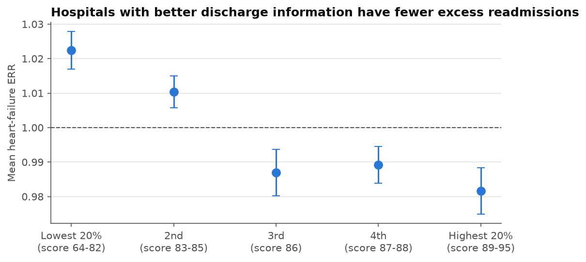
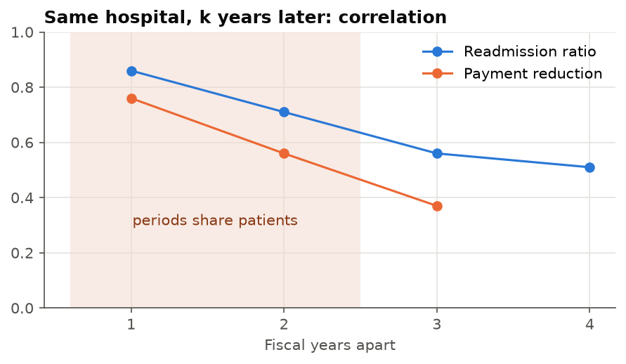
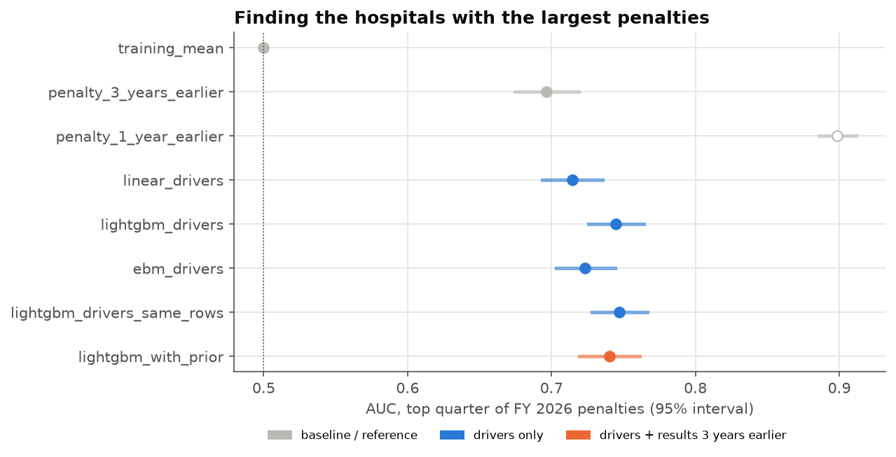

# Hospital Readmission Intelligence

> **Status: work in progress.** The project is built in public, step by step. Every important
> decision is committed separately and explained in [docs/decisions.md](docs/decisions.md).

## The problem

Medicare's **Hospital Readmissions Reduction Program (HRRP)** cuts up to **3% of a hospital's
Medicare base payments** when too many patients come back within 30 days of discharge for
heart attack, heart failure, pneumonia, COPD, hip/knee replacement or bypass surgery.

This project uses **real, public CMS and CDC data** on about 3,000 US hospitals to answer
three questions a hospital or health plan would pay for:

1. **Which hospitals are at risk** of a readmission penalty?
2. **Why?** Which drivers (patient experience, hospital profile, community health) explain the risk?
3. **What is it worth?** How many Medicare dollars are at stake, and what would improvement save?

## Data (all public, no patient-level data)

| Source | Grain (one row =) | Role in the project |
|---|---|---|
| [CMS Hospital Readmissions Reduction Program](https://data.cms.gov/provider-data/dataset/9n3s-kdb3) | hospital × condition | **Target**: Excess Readmission Ratio (ERR) |
| [CMS HRRP Supplemental Data Files](https://www.cms.gov/medicare/payment/prospective-payment-systems/acute-inpatient-pps/archived-supplemental-data-files) (FY 2020–2026) | hospital × fiscal year | Peer group, peer-group median ERRs, penalty indicators, actual payment reduction |
| [CMS Patient Survey (HCAHPS) – Hospital](https://data.cms.gov/provider-data/dataset/dgck-syfz) | hospital × survey answer | Drivers: discharge information, communication scores |
| [CMS Hospital General Information](https://data.cms.gov/provider-data/dataset/xubh-q36u) | hospital | Hospital profile: type, ownership, county, star rating |
| [CDC PLACES – County Data](https://data.cdc.gov/500-Cities-Places/PLACES-Local-Data-for-Better-Health-County-Data-20/swc5-untb) | county × health measure | Community context: chronic disease, insurance, transportation |
| [Census ZCTA–county relationship files](https://www.census.gov/geographies/reference-files/time-series/geo/relationship-files.html) (2020, plus Connecticut 2022) | ZIP area × county | Links each hospital's ZIP code to the county code PLACES uses ([why](docs/decisions.md#d-022--link-hospitals-to-counties-by-zip-code-checked-against-the-county-name--accepted-step-5)) |

| [CMS hospital data archive](https://data.cms.gov/provider-data/archived-data/hospitals) (quarterly snapshots since 2019) | snapshot × the rows above | Past releases of HRRP, the patient survey and hospital profiles, to line up time periods ([why](docs/decisions.md#d-023--historical-releases-from-the-cms-archive-matched-by-period--accepted-step-6)) |

More sources (Medicare inpatient payments, complications, spending per beneficiary) are added
when the project reaches the step that needs them.

## What the data shows so far

From the data exploration notebook
([read it with results](https://saikrishna0107.github.io/Healthcare-readmission-intelligence/notebooks/01_data_exploration.html)
· [source](notebooks/01_data_exploration.py)):

- **Small differences decide penalties.** Half of all hospital-condition scores fall between an
  Excess Readmission Ratio of 0.96 and 1.04.
- **Penalties are common.** 77% of HRRP hospitals are above 1.0 on at least one condition.
  CMS judges each hospital against the median of its peer group (hospitals with a similar
  share of low-income patients), not against 1.0.
- **Missing is not zero.** 36% of scores are missing, mostly because a hospital had too few
  cases. Treating them as zero would make small hospitals look perfect.
- **A data-leakage trap.** The current patient survey was collected *after* the readmission
  period it would explain, so archived survey releases are needed to line the periods up.
- **A first driver.** Hospitals with the best discharge-information scores average a
  heart-failure ratio of 0.98; those with the lowest average 1.02 (association, not causation).



From the cleaned, tested data ([D-021](docs/decisions.md#d-021--data-tests-every-staging-rule-is-tested-known-gaps-warn--accepted-step-4)):

- **The penalty formula is reproduced exactly, every year.** Recomputing each hospital's payment
  reduction from CMS's published inputs matches all 21,263 hospital-years from FY 2020 to FY 2026
  within 0.01 percentage points. In FY 2026, 2,304 hospitals (78%) are penalized; 15 hit the 3% cap.
- **Penalties shrank after FY 2022 and stayed lower.** The average cut fell from 0.53% of
  Medicare base payments (FY 2022) to 0.32% (FY 2023), when CMS left pneumonia out because of
  COVID-19, and has stayed between 0.32% and 0.34% since; the share penalized went from 82% to
  75-79%. Why it stayed low is a question for the time-aligned data in step 6c
  ([D-023](docs/decisions.md#d-023--historical-releases-from-the-cms-archive-matched-by-period--accepted-step-6)).
- **Being above the median is not enough.** A condition counts toward the penalty only with at
  least 25 eligible discharges; 1,547 hospital-condition pairs are above their peer median but
  too small to be penalized.
- **Every HRRP hospital with a profile has a county.** Linking by ZIP code, checked against the
  county name, reaches all 3,035 HRRP hospitals that have a hospital profile (20 have none, so
  no ZIP code), up from 95.9% by name alone. Names
  alone also matched 18 hospitals to *two* counties (Baltimore, St. Louis and Fairfax are each
  both a county and an independent city), which would have duplicated them in any analysis
  ([D-022](docs/decisions.md#d-022--link-hospitals-to-counties-by-zip-code-checked-against-the-county-name--accepted-step-5)).
- **Community context matters, at first sight.** Hospitals in the quarter of counties where most
  adults lack reliable transportation average a heart-failure ERR of 1.021; in the quarter where
  fewest do, 0.986 (association, not causation; 1,880 hospitals with that measure).
- **A driver that holds year after year, without leakage.** With each year's survey taken from
  a window that ends before its readmission period does
  ([D-008](docs/decisions.md#d-008--align-time-periods-to-prevent-data-leakage--accepted-implemented-at-step-6)),
  hospitals in the lowest quarter of "care transition" scores (were the patient's needs
  considered when planning discharge) average a heart-failure ERR of 1.020 - 1.032, the top
  quarter 0.979 - 0.985, in every fiscal year from FY 2020 to FY 2026 (correlation about -0.25
  each year; association, not causation).
- **Community data has gaps.** Kentucky and Pennsylvania have no 2023 chronic disease estimates
  in the current PLACES release (190 HRRP hospitals), and social needs measures cover 2,299 of
  3,144 counties. They stay NULL, flagged, never filled in
  ([D-007](docs/decisions.md#d-007--star-schema-for-the-marts--accepted-step-5)).

From the modeling table, before any model is trained
([read it with results](https://saikrishna0107.github.io/Healthcare-readmission-intelligence/notebooks/02_modeling_data.html)
· [source](notebooks/02_modeling_data.py)):

- **The model predicts each hospital's penalty**, one row per hospital and fiscal year (21,263
  rows), and is judged on finding the top quarter of penalties in a year: 75-83% of hospitals are
  penalized every year, so "penalized or not" is a weak question
  ([D-002](docs/decisions.md#d-002--target-the-hospitals-hrrp-penalty-built-on-the-excess-readmission-ratio--accepted-revised-at-step-7)).
- **Neighbouring years share patients.** Each penalty uses three years of patients and the
  window slides by one year, so a hospital's ratio correlates at 0.86 with the next year's but
  0.56 three years later. A random split would test the model partly on what it learned. The
  model trains on FY 2020-2023 and is tested on FY 2026, whose period starts the day after
  FY 2023's ends; a dbt test enforces it
  ([D-024](docs/decisions.md#d-024--validation-by-time-without-shared-patients-and-a-leakage-review-for-every-feature--accepted-step-7)).
- **Every column has a role and every feature a leakage review**, in the dbt YAML. A dbt
  contract and a pytest make sure nothing enters the table unreviewed. The CMS star rating is
  kept out: it includes readmissions, so it would leak the answer.
- **Small hospitals are rarely penalized**, by construction: CMS shrinks their ratios toward
  1.0, so about half are penalized (82-91% of the rest) and under 8% reach the top quarter.
- **Poverty barely moves the penalty (rank correlation -0.03)**, because CMS compares each
  hospital only with peers serving a similar share of low-income patients. Patient-experience
  scores do (-0.14 to -0.20), and for-profit hospitals average the largest cuts (0.63% vs 0.50%).



## Model results (step 7)

Trained on FY 2020-2023, scored once on FY 2026 (2,945 hospitals), which shares no patients
with the training years. The model was chosen by cross-validation on the training years, before
looking at the test year. AUC = how well the model finds the hospitals in the top quarter of
penalties (0.5 = guessing); brackets are 95% bootstrap intervals
([read it with results](https://saikrishna0107.github.io/Healthcare-readmission-intelligence/notebooks/03_model_results.html)
· [source](notebooks/03_model_results.py)
· [model card](docs/model_card.md)
· [decision](docs/decisions.md#d-009--compare-three-models-validate-on-a-later-year--accepted-step-7)
· [all numbers](reports/model/metrics.json)).

| Model | AUC top quarter | Rank correlation |
|---|---|---|
| Everyone gets the training average | 0.500 | - |
| The hospital's own penalty 3 years earlier | 0.697 [0.67-0.72] | 0.40 |
| Ridge regression on drivers (survey, volume, ownership, county, patient mix) | 0.715 [0.69-0.74] | 0.46 |
| Explainable Boosting Machine (EBM) on drivers | 0.724 [0.70-0.74] | 0.42 |
| **LightGBM on drivers (chosen)** | **0.745** [0.73-0.76] | **0.50** |

- **LightGBM beats ridge by 0.030 AUC** (paired interval +0.014 to +0.046) and the hospital's own
  history by 0.048. Of the quarter of hospitals it flags, half really land in the top quarter of
  penalties (a random pick: a quarter); their average cut is 0.60% against 0.26% for the rest.
- **A leaky split flatters flexible models.** Trained on a random split, LightGBM would report
  0.776 and EBM 0.774 instead of 0.745 and 0.724; ridge barely moves. "Last year's penalty" would
  score 0.90, because its period shares two thirds of the patients with the year it scores.
- **Volume and county conditions drive the predictions**, then patient-experience scores, in
  both LightGBM (SHAP) and EBM, summed by feature family. Association, not cause.
- **Prior results help ridge (+0.045 AUC) but not LightGBM**: penalties were halved from FY 2023,
  and the trees learned the old scale. Cross-validation could not see it; the test year did
  ([model card](docs/model_card.md#limits-and-known-issues)).



## Asking the data: one definition per metric (step 8)

The same question can have several honest answers. "Average HRRP penalty in FY 2026" is
**0.344%** over all hospitals in the payment file, or **0.440%** over the penalized ones only.
Before an LLM answers questions, every metric is defined once in a **semantic layer**
([dbt MetricFlow](https://docs.getdbt.com/docs/build/about-metricflow)), and the agent may only
choose from it ([why](docs/decisions.md#d-025--semantic-layer-dbt-metricflow-read-only-with-reconciled-metrics--accepted-step-8)):

- **17 approved metrics** (penalties, readmission ratios, patient survey), each with a definition
  that says what is counted. MetricFlow writes the SQL, including the joins.
- **Read-only by construction**, structured filters only, at most 500 rows per answer.
- **Every metric reconciled** with hand-written SQL in a test; deliberately breaking a
  definition makes it fail.
- Left out on purpose: an "observed readmission rate", because CMS hides counts below 11 and the
  rate would silently drop small hospitals.

```
$ hri sl query share_penalized hospitals_in_payment_file --by hospital__ownership --where fiscal_year=FY2026 --order=-share_penalized
                        hospital__ownership  share_penalized  hospitals_in_payment_file
               Voluntary non-profit - Other         0.838428                        229
             Voluntary non-profit - Private         0.810754                       1432
...
share_penalized: Penalized hospitals / hospitals in the payment file, as a fraction (0.78 = 78%).
```

### Asking in plain English (step 8b)

`hri ask` sends the question to a **local** model ([Ollama](https://ollama.com), IBM
`granite4.1:3b`, 2.1 GB, runs on the CPU), so no data leaves the machine and no key is needed
([why](docs/decisions.md#d-010--llm-agent-through-a-semantic-layer-with-an-evaluation-set--proposed-step-8)).
The model writes a **query plan**, not SQL and not the answer:

1. **Plan.** The model returns JSON (metrics, breakdowns, filters, sort, limit, or a decline).
   The JSON schema lists the approved names, so Ollama can only produce those.
2. **Check and fix values in code.** For example `Maryland` becomes `MD` and `johns hopkins
   hospital` becomes `JOHNS HOPKINS HOSPITAL, THE`. Every change is printed as a note.
3. **One repair.** If the plan cannot run, the error goes back to the model once.
4. **Run** through the semantic layer, read-only.
5. **Answer written by code** from the result table. The numbers never pass through the model.

Rules in code, not in the prompt:

- no year means the latest one
- a range of years gets one row per year, never one total
- "A vs B" becomes a side-by-side comparison
- a hospital name shared across states is flagged

Questions about patients, causes ("why"), predictions or advice are declined.

```
$ hri ask "Which 5 states had the highest share of hospitals penalized?"
Share of hospitals penalized (fiscal year = FY2026):

state Share of hospitals penalized
   FL                        92.8%
   NH                        92.3%
   NJ                        91.8%
   HI                        90.9%
   NV                        90.0%
  Note: No year given: used FY2026, the latest.
```

On this laptop (i7-1165G7, no graphics card) a question takes **8-18 seconds** once the model is
loaded. The first question after a start takes about a minute, while the model loads and reads
the 1,800-token catalog.

The 3B model still makes mistakes, for example a count where a share was asked. How often it is
wrong is measured next (8c), on a fixed question set with answers from hand-written SQL.

## Planned architecture

```
CMS / CDC APIs ──► Python ingestion ──► raw Parquet ──► dbt + DuckDB (staging ► marts, tested)
                                                               │
                        ┌──────────────────────────────────────┼─────────────────────┐
                        ▼                                      ▼                     ▼
             ML: penalty-risk model               LLM agent: questions in       Power BI
             (3-model comparison + SHAP)          plain English ► governed SQL   dashboard
```

## Roadmap

- [x] 1. Project skeleton, README and decision log
- [x] 2. Data exploration: what each dataset contains and its traps
- [x] 3. Ingestion from the CMS and CDC APIs
- [x] 4. Cleaning (dbt staging models), missing-value reasons and 80 data tests
- [x] 5. Hospital-to-county join with a match-rate test, first star-schema tables
- [x] 6. Archived data to align time periods (prevents data leakage)
- [x] 7. Validation design, baselines and a three-model comparison (ridge, LightGBM, EBM) explained with SHAP
- [ ] 8. LLM question-answering agent with an evaluation set (8a semantic layer, 8b agent done)
- [ ] 9. Power BI dashboard
- [ ] 10. CI and scheduled data refresh

## Running it yourself

Requires Python 3.12. From the project folder:

```bash
python -m venv .venv
.venv/Scripts/pip install -e ".[dev]"      # macOS/Linux: .venv/bin/pip
```

This installs the project's own package (`src/hri`) plus the development tools (pytest, ruff).

### Pipeline commands

```bash
.venv/Scripts/hri ingest                 # download new releases of every source (skips stored ones)
.venv/Scripts/hri ingest --only hrrp     # just one source
.venv/Scripts/hri status                 # what is stored, which release, how many rows
.venv/Scripts/hri dbt build              # clean the data into data/hri.duckdb and run its 211 checks
.venv/Scripts/hri model train            # train and score the penalty models (about 20 minutes)
.venv/Scripts/hri sl list                  # the approved metrics of the semantic layer
.venv/Scripts/hri sl query share_penalized --by hospital__state --where fiscal_year=FY2026 --order=-share_penalized --limit 10
.venv/Scripts/hri ask "How many hospitals were penalized each year?"   # needs Ollama + granite4.1:3b
.venv/Scripts/python -m pytest           # run the tests (no internet needed)
```

`hri dbt` passes its arguments to [dbt](https://docs.getdbt.com/) and runs it from the
[dbt/](dbt/) folder, for example `hri dbt debug` (check the setup) or
`hri dbt docs generate` then `hri dbt docs serve` (browse every table and the lineage graph).
dbt reads the raw Parquet files in place through DuckDB
([why](docs/decisions.md#d-019--dbt-reads-the-raw-parquet-files-as-sources-all-releases-at-once--accepted-step-4)).

The cleaned tables live in `data/hri.duckdb`, in the schemas `staging`, `intermediate`, `marts`, `ml` and `semantic`
([conventions](docs/decisions.md#d-020--staging-conventions-strict-conversion-tables-one-naming-scheme--accepted-step-4)).
Query them from Python or any DuckDB client:

```python
import duckdb
con = duckdb.connect("data/hri.duckdb", read_only=True)
con.sql("select score_status, count(*) from staging.stg_cms__hrrp group by 1").show()
con.sql("select state, count(*), avg(diabetes_pct) from marts.dim_county group by 1").show()
con.sql("select fiscal_year, avg(payment_reduction_pct) from marts.fct_hospital_year group by 1 order by 1").show()
con.sql("select split, count(*), avg(is_top_quarter_penalty::int) from ml.ml_penalty_features group by 1").show()
```

The first `hri ingest` also downloads every archived CMS snapshot since 2019 (about 500 MB,
a few minutes); later runs only fetch snapshots published since.
Sources are listed in [config/sources.yaml](config/sources.yaml). Each release is stored untouched
as `data/raw/<source>/<release>.parquet`, with a download log in `data/raw/manifest.json`
([why](docs/decisions.md#d-018--raw-layer-untouched-text-one-parquet-file-per-release--accepted-step-3)).

Notebooks use [marimo](https://marimo.io) and are plain `.py` files:

```bash
.venv/Scripts/marimo edit notebooks/01_data_exploration.py     # open as an interactive notebook
.venv/Scripts/python notebooks/01_data_exploration.py          # or run it as a script
```

Notebook 01 runs `hri ingest` for the sources it needs, so the first run downloads the data
(about 110 MB) and later runs reuse it. Notebook 02 reads the warehouse, so run `hri ingest` and
`hri dbt build` first; notebook 03 also needs `hri model train`.
After changing a notebook, refresh its published page:

```bash
.venv/Scripts/marimo export html notebooks/01_data_exploration.py -o docs/notebooks/01_data_exploration.html
```

## Following the progress

- **Commit history**: one commit per step, each message says what was decided and why.
- **[docs/decisions.md](docs/decisions.md)**: every major decision with its reasoning and the
  alternatives that were considered.
